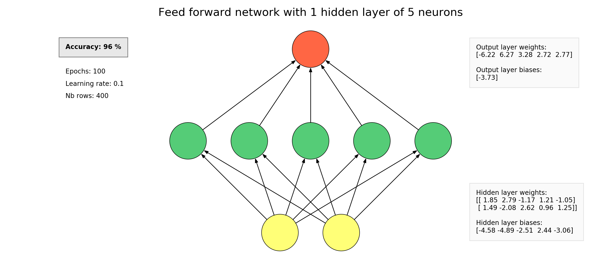

# A feed forward neuronal network implementation in python (without the use of external libraries) for learning purposes



The feed_forward python file implements a neuronal network (FF class). You can set up the number of inputs and the number of neurons in the hidden layer. You can load a dataset (and targets) into the network and then train the network. Finally, you can draw the network and watch the current accuracy.

## Instantiate a network
```python
ff = FF(nb_features=2, hidden_layer_size=5)
```
*nb_features* is the number of features that will be loaded into the network.

*hidden_layer_size* is the number of neurons in the hidden layer.

## Load a dataset
```python
ff.load_dataset(dataset=dataset, targets=targets)
```
*dataset* is a numpy ndarray representing the data to work on.

*targets* is an numpy ndarray representing the expected results.

## Train the network
```python
ff.train(epochs=100, learning_rate=0.1)
```
*epochs* is an integer corresponding to the number of epochs used during training.

*learning_rate* is the learning rate used during training.

## Draw the network
Display the feed forward network, its accuracy and the weights and biases of all neurons. It also display the number of epochs, the learning rate and the number of rows (dataset size) used during the training. It allows to show directly the impact of theses parameters to the accuracy.

It uses the [Viznet](https://github.com/GiggleLiu/viznet) library.
```python
ff.draw()
```

Have a look at the examples shown in the examples file !
